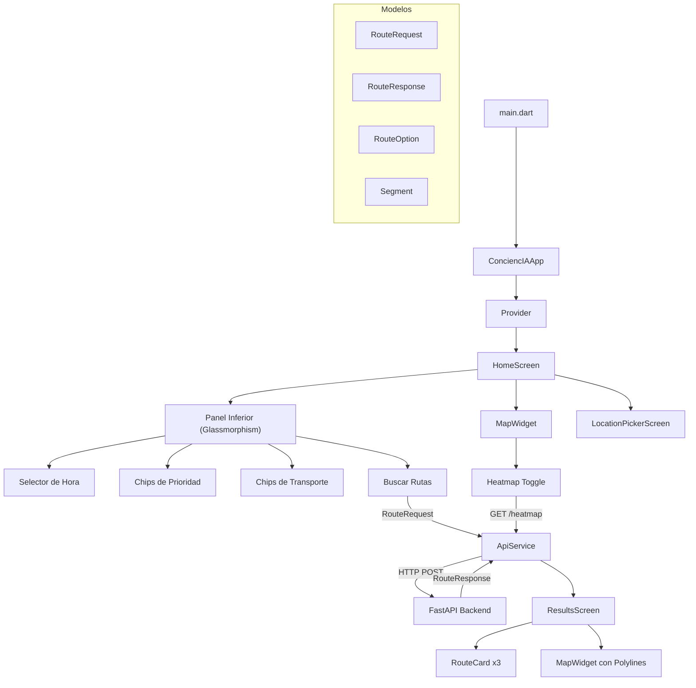
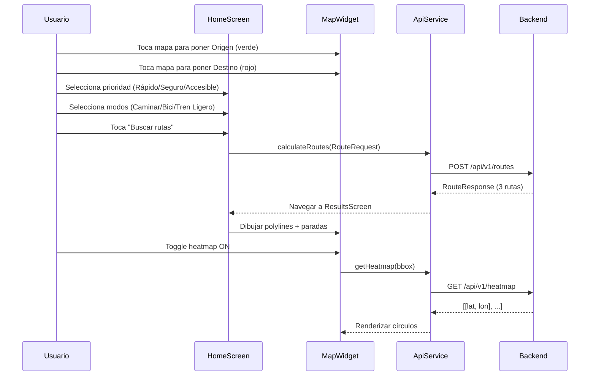

# Arquitectura de la App — ConciencIA Flutter

## Diagrama de Arquitectura



## Estructura de Directorios

```
app/lib/
├── main.dart                    # Entry point, tema Material 3, locale es_MX
├── config/
│   └── app_config.dart          # URL del backend, coords default, tile URL
├── models/
│   ├── route_request.dart       # RouteRequest, Coordinate, TransportMode, TravelPriority
│   ├── route_response.dart      # RouteResponse, RouteOption, Segment, Parada
│   └── route_loading_state.dart # Estados de carga con mensajes progresivos
├── screens/
│   ├── home_screen.dart         # Pantalla principal (mapa + panel)
│   ├── results_screen.dart      # Resultados con 3 rutas
│   └── location_picker_screen.dart  # Selector de ubicación en mapa
├── services/
│   └── api_service.dart         # Cliente HTTP (routes + heatmap + health)
└── widgets/
    ├── map_widget.dart          # Mapa flutter_map con heatmap y controles
    ├── route_card.dart          # Tarjeta glassmorphism de ruta
    ├── route_input_form.dart    # Formulario origen/destino
    └── route_loading_overlay.dart  # Overlay shimmer de carga
```

## Flujo de Usuario



## Patrones de Diseño

| Patrón | Uso |
|--------|-----|
| **Provider** | Inyección de `ApiService` como singleton |
| **Stateful Widget** | `HomeScreen` (marcadores, panel, estado de carga) |
| **Composición** | Pantallas compuestas por widgets reutilizables |
| **Service Layer** | `ApiService` encapsula toda la comunicación HTTP |

## Componentes Clave

| Componente | Responsabilidad |
|-----------|----------------|
| `HomeScreen` | Mapa + panel colapsable + lógica de marcadores |
| `ResultsScreen` | Muestra 3 `RouteCard` + mapa con polylines |
| `MapWidget` | flutter_map, tiles CartoDB Voyager, heatmap, zoom +/− |
| `RouteCard` | Glassmorphism, resumen IA, tags, métricas, instrucciones |
| `ApiService` | HTTP client con timeout 60s y manejo de errores |

## Diseño Visual

- **Tema**: Material 3 Light, seed `#1A73E8`
- **Tipografía**: Inter (cuerpo) + Outfit (títulos)
- **Efectos**: Glassmorphism (`BackdropFilter`), shimmer en carga
- **Tiles**: CartoDB Voyager (estilo navegación limpio)

## Tecnologías

| Dependencia | Uso |
|------------|-----|
| `flutter_map` | Mapa OSM sin API key |
| `latlong2` | Coordenadas geográficas |
| `http` | Cliente HTTP |
| `provider` | State management |
| `geolocator` | GPS del dispositivo |
| `google_fonts` | Inter + Outfit |
| `shimmer` | Animación de carga |
| `intl` | Localización es_MX |
